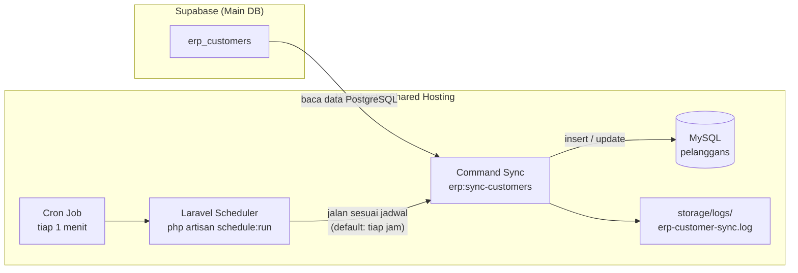
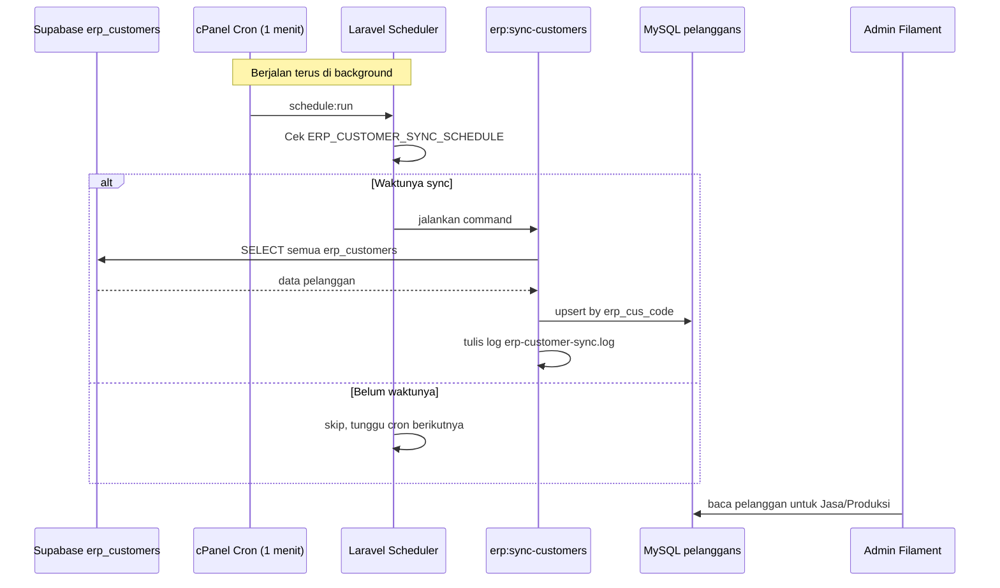

# Implementasi Sync Pelanggan ERP → Artha Jaya (Niagahoster, Tanpa VPS)

Panduan ini menjelaskan cara menjalankan **sync otomatis** data pelanggan dari Supabase (`erp_customers`) ke tabel lokal `pelanggans` di hosting **Niagahoster shared hosting** (tanpa VPS).

---

## Ringkasan arsitektur



**Prinsip kerja:**

1. Data master pelanggan ada di **Supabase** (`erp_customers`).
2. Aplikasi Artha Jaya menyimpan salinan lokal di **MySQL** (`pelanggans`).
3. **Cron** di cPanel menjalankan Laravel Scheduler **setiap menit**.
4. Scheduler mengecek jadwal sync (default: **setiap jam**).
5. Jika waktunya tiba, command `erp:sync-customers` dijalankan:
   - Pelanggan **baru** → insert ke `pelanggans`
   - Pelanggan **sudah ada** (berdasarkan `erp_cus_code`) → update data
6. Hasil sync tercatat di log.

> **Catatan:** Di shared hosting tanpa VPS, sync **tidak real-time detik-an**, melainkan **berkala** (mis. tiap 15 menit atau tiap jam). Semakin sering jadwal cron sync, semakin cepat data baru muncul di aplikasi.

---

## Prasyarat

| Item | Keterangan |
|------|------------|
| Hosting | Niagahoster shared (cPanel + SSH) |
| PHP | 8.2+ |
| Ekstensi PHP | `pdo`, `pdo_mysql`, **`pdo_pgsql`** (wajib untuk koneksi Supabase) |
| MySQL | Database lokal aplikasi Artha Jaya |
| Supabase | Kredensial koneksi PostgreSQL (pooler) |
| Akses | SSH + Cron Jobs di cPanel |

### Cek ekstensi `pdo_pgsql` (via SSH)

```bash
cd ~/artha-jaya
php -m | grep pgsql
```

Harus muncul:

```
pdo_pgsql
pgsql
```

Jika **tidak ada**, buka **cPanel → Select PHP Version → Extensions**, centang `pgsql` / `pdo_pgsql`, lalu save. Jika opsi tidak tersedia, hubungi support Niagahoster untuk mengaktifkan ekstensi PostgreSQL.

---

## Struktur folder di Niagahoster

Contoh layout (sesuaikan username Anda):

```
/home/u381971818/artha-jaya/          ← root project Laravel (.env, artisan, app/)
/home/u381971818/public_html/         ← document root (isi folder public/)
```

Pastikan `public_html/index.php` mengarah ke bootstrap Laravel di folder `artha-jaya`.

---

## Tahap implementasi

### Tahap 1 — Persiapan kode di server

#### 1.1 Upload / pull kode terbaru

Via SSH:

```bash
cd ~/artha-jaya
git pull origin main
```

Atau upload manual file/folder terkait sync:

- `app/Services/ErpCustomerSyncService.php`
- `app/Console/Commands/SyncErpCustomers.php`
- `config/erp.php`
- `config/database.php` (koneksi `supabase`)
- `database/migrations/2026_06_06_100000_add_erp_cus_code_to_pelanggans_table.php`
- `routes/console.php`

#### 1.2 Install dependency & clear cache

```bash
cd ~/artha-jaya
composer install --no-dev --optimize-autoloader --no-interaction
php artisan optimize:clear
```

---

### Tahap 2 — Konfigurasi environment (`.env`)

Edit file `.env` di folder `artha-jaya`:

```bash
nano ~/artha-jaya/.env
```

Tambahkan / pastikan blok berikut ada:

```env
# Database lokal (MySQL Niagahoster)
DB_CONNECTION=mysql
DB_HOST=localhost
DB_PORT=3306
DB_DATABASE=nama_database_anda
DB_USERNAME=user_database_anda
DB_PASSWORD=password_database_anda

# Supabase PostgreSQL (main ERP database)
SUPABASE_DB_HOST=aws-0-ap-southeast-1.pooler.supabase.com
SUPABASE_DB_PORT=6543
SUPABASE_DB_DATABASE=postgres
SUPABASE_DB_USERNAME=postgres.xxxxxxxxxxxx
SUPABASE_DB_PASSWORD=password_supabase_anda
SUPABASE_DB_SSLMODE=require

# Jadwal sync pelanggan (cron expression)
# Default: tiap jam di menit ke-0 → "0 * * * *"
# Rekomendasi agar data baru cepat masuk (tiap 15 menit):
ERP_CUSTOMER_SYNC_SCHEDULE=*/15 * * * *

# Lewati pelanggan bermasalah (status_bad_yn = 1)
ERP_SKIP_BAD_CUSTOMERS=true

# Cache & queue (penting untuk scheduler)
CACHE_STORE=database
QUEUE_CONNECTION=database
```

Simpan file, lalu:

```bash
php artisan config:clear
php artisan config:cache
```

#### Referensi jadwal sync

| Kecepatan | Nilai `ERP_CUSTOMER_SYNC_SCHEDULE` | Keterangan |
|-----------|-------------------------------------|------------|
| Tiap jam | `0 * * * *` | Default, beban server ringan |
| Tiap 30 menit | `*/30 * * * *` | Seimbang |
| **Tiap 15 menit** | `*/15 * * * *` | **Disarankan** untuk data baru |
| Tiap 5 menit | `*/5 * * * *` | Lebih agresif, beban sedikit naik |

---

### Tahap 3 — Migration & sync pertama (manual)

#### 3.1 Jalankan migration

Menambahkan kolom `erp_cus_code` di tabel `pelanggans`:

```bash
cd ~/artha-jaya
php artisan migrate --force
```

#### 3.2 Sync pertama (import semua data ERP)

```bash
php artisan erp:sync-customers
```

Output sukses contoh:

```
+------------+--------+
| Metrik     | Jumlah |
+------------+--------+
| Total ERP  | 9906   |
| Baru       | 7793   |
| Diperbarui | 2107   |
| Dilewati   | 6      |
+------------+--------+
Sync pelanggan selesai.
```

#### 3.3 Verifikasi data

```bash
php artisan tinker --execute="echo App\Models\Pelanggan::whereNotNull('erp_cus_code')->count();"
```

Angka harus mendekati jumlah data di Supabase `erp_customers`.

---

### Tahap 4 — Aktifkan sync otomatis (Cron Job)

Ini tahap **paling penting** agar sync berjalan sendiri tanpa intervensi manual.

#### 4.1 Buat Cron Job di cPanel

1. Login **cPanel Niagahoster**
2. Buka menu **Cron Jobs** / **Penjadwal Cron**
3. Tambahkan cron **setiap 1 menit**:

**Common Settings:** `Every Minute (* * * * *)`

**Command:**

```bash
cd /home/USERNAME/artha-jaya && /usr/bin/php artisan schedule:run >> /dev/null 2>&1
```

> Ganti `USERNAME` dengan username cPanel Anda (contoh: `u381971818`).
>
> Jika path PHP berbeda, cek dengan: `which php` via SSH.

#### 4.2 Cron alternatif (dengan log scheduler)

Jika ingin log scheduler tersimpan:

```bash
cd /home/USERNAME/artha-jaya && /usr/bin/php artisan schedule:run >> storage/logs/scheduler.log 2>&1
```

#### 4.3 Apa yang terjadi setelah cron aktif?

```
Setiap 1 menit:
  schedule:run → cek jadwal di routes/console.php
                 ↓
  Jika waktunya sesuai ERP_CUSTOMER_SYNC_SCHEDULE:
                 ↓
  erp:sync-customers → tarik data Supabase → upsert ke pelanggans
                 ↓
  Hasil ditulis ke storage/logs/erp-customer-sync.log
```

**Contoh:** Jika `ERP_CUSTOMER_SYNC_SCHEDULE=*/15 * * * *`, maka sync otomatis jalan pada menit **:00, :15, :30, :45** setiap jam.

---

### Tahap 5 — Monitoring & pemastian sync jalan

#### 5.1 Cek log sync

```bash
tail -f ~/artha-jaya/storage/logs/erp-customer-sync.log
```

#### 5.2 Cek log error Laravel

```bash
tail -f ~/artha-jaya/storage/logs/laravel.log
```

#### 5.3 Tes manual ulang (opsional)

```bash
cd ~/artha-jaya
php artisan erp:sync-customers
```

#### 5.4 Lihat jadwal terdaftar

```bash
php artisan schedule:list
```

Harus muncul baris command `erp:sync-customers` dengan cron sesuai `.env`.

#### 5.5 Simulasi data baru

1. Tambah / update record di Supabase tabel `erp_customers`
2. Tunggu jadwal sync berikutnya (mis. maks 15 menit jika pakai `*/15`)
3. Cek di admin Filament → menu **Pelanggan**
4. Atau via SSH:

```bash
php artisan tinker --execute="echo App\Models\Pelanggan::where('erp_cus_code','KODE_CUS_ANDA')->value('nama');"
```

---

### Tahap 6 — Maintenance setelah update kode

Setiap kali deploy versi baru:

```bash
cd ~/artha-jaya
git pull
composer install --no-dev --optimize-autoloader --no-interaction
php artisan migrate --force
php artisan optimize:clear
php artisan config:cache
php artisan route:cache
php artisan view:cache
```

Cron **tidak perlu diubah** selama path project tetap sama.

---

## Mapping data sync

| Supabase `erp_customers` | MySQL `pelanggans` | Keterangan |
|--------------------------|-------------------|------------|
| `cus_code` | `erp_cus_code` | Kunci unik sync |
| `cus_name` | `nama` | Nama pelanggan |
| `tel` | `kontak` | Fallback: `email`, lalu `-` |
| `address`, `town`, `state` | `alamat` | Digabung dengan koma |
| `date_time_modified` | `UpdateAt` | Waktu update terakhir |
| — | `createdAt` | Diisi saat insert pertama |

Pelanggan dengan `status_bad_yn = 1` dilewati (bisa dimatikan via `ERP_SKIP_BAD_CUSTOMERS=false`).

---

## Troubleshooting

### Sync tidak jalan otomatis

| Gejala | Penyebab | Solusi |
|--------|----------|--------|
| Log sync kosong | Cron belum dibuat / path salah | Perbaiki cron di cPanel, pastikan path `cd` benar |
| `schedule:list` kosong | Config cache lama | `php artisan config:clear && php artisan config:cache` |
| Sync manual jalan, otomatis tidak | Cron PHP path salah | Ganti ke `/usr/bin/php` atau hasil `which php` |
| Permission denied log | Folder log tidak writable | `chmod -R 755 storage && chmod -R 775 storage/logs` |

### Error koneksi Supabase

| Error | Solusi |
|-------|--------|
| `could not find driver` | Aktifkan ekstensi `pdo_pgsql` di cPanel |
| `Connection timed out` | Pastikan hosting mengizinkan outbound ke Supabase port **6543** |
| `password authentication failed` | Cek ulang `SUPABASE_DB_USERNAME` dan `SUPABASE_DB_PASSWORD` |
| `SSL connection required` | Set `SUPABASE_DB_SSLMODE=require` |

### Sync lambat

- Normal untuk sync pertama (~10.000 record ≈ 30–60 detik).
- Sync berikutnya lebih cepat karena kebanyakan hanya update.
- Jika perlu lebih cepat deteksi data baru, perkecil interval: `*/5 * * * *`.

### Duplikat / data tidak update

- Sync menggunakan `erp_cus_code` (= `cus_code` ERP) sebagai kunci.
- Pastikan migration kolom `erp_cus_code` sudah jalan.
- Jalankan ulang: `php artisan erp:sync-customers`

---

## Checklist go-live

Gunakan checklist ini sebelum menyerahkan ke production:

- [ ] Ekstensi `pdo_pgsql` aktif di hosting
- [ ] Variabel `SUPABASE_DB_*` benar di `.env`
- [ ] `php artisan migrate --force` sukses
- [ ] `php artisan erp:sync-customers` sukses (sync pertama)
- [ ] Cron `schedule:run` aktif **setiap 1 menit** di cPanel
- [ ] `ERP_CUSTOMER_SYNC_SCHEDULE` diset (disarankan `*/15 * * * *`)
- [ ] Log `storage/logs/erp-customer-sync.log` terisi setelah jadwal lewat
- [ ] Data pelanggan terlihat di admin Filament
- [ ] Tes: tambah data di Supabase → muncul di app setelah 1 siklus sync

---

## FAQ

### Apakah perlu VPS?

**Tidak.** Sync otomatis cukup dengan **Cron Job** bawaan Niagahoster shared hosting.

### Seberapa cepat data baru masuk?

Tergantung `ERP_CUSTOMER_SYNC_SCHEDULE`:

- Tiap jam → delay maks ~60 menit
- Tiap 15 menit → delay maks ~15 menit

Cron `schedule:run` tetap jalan tiap menit; yang menentukan **kapan sync dieksekusi** adalah jadwal di atas.

### Apakah sync menghapus pelanggan lokal jika dihapus di ERP?

**Tidak.** Saat ini sync hanya **insert & update**. Data lokal yang sudah ada tidak dihapus otomatis.

### Apakah pelanggan yang dibuat manual di app ikut tersync?

Pelanggan manual **tanpa** `erp_cus_code` tidak akan tertimpa. Saat ERP punya `cus_code` baru, record baru akan dibuat terpisah kecuali Anda mapping manual.

### Command penting

| Command | Fungsi |
|---------|--------|
| `php artisan erp:sync-customers` | Sync manual |
| `php artisan schedule:list` | Lihat jadwal |
| `php artisan schedule:run` | Jalankan scheduler sekali (debug) |
| `php artisan optimize:clear` | Clear cache setelah ubah `.env` |

---

## Diagram alur lengkap (end-to-end)



---

## Referensi file di project

| File | Peran |
|------|-------|
| `config/database.php` | Koneksi `supabase` (PostgreSQL) |
| `config/erp.php` | Mapping kolom & jadwal sync |
| `app/Services/ErpCustomerSyncService.php` | Logika sync |
| `app/Console/Commands/SyncErpCustomers.php` | Artisan command |
| `routes/console.php` | Registrasi jadwal scheduler |
| `database/migrations/2026_06_06_100000_add_erp_cus_code_to_pelanggans_table.php` | Kolom kunci sync |

---

**Terakhir diperbarui:** Juni 2026  
**Target hosting:** Niagahoster shared (tanpa VPS)
