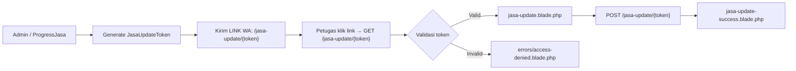
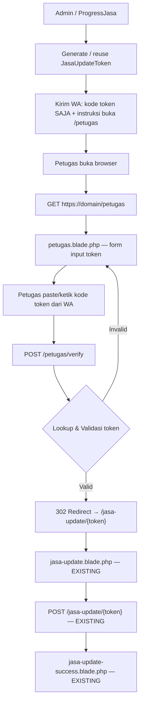
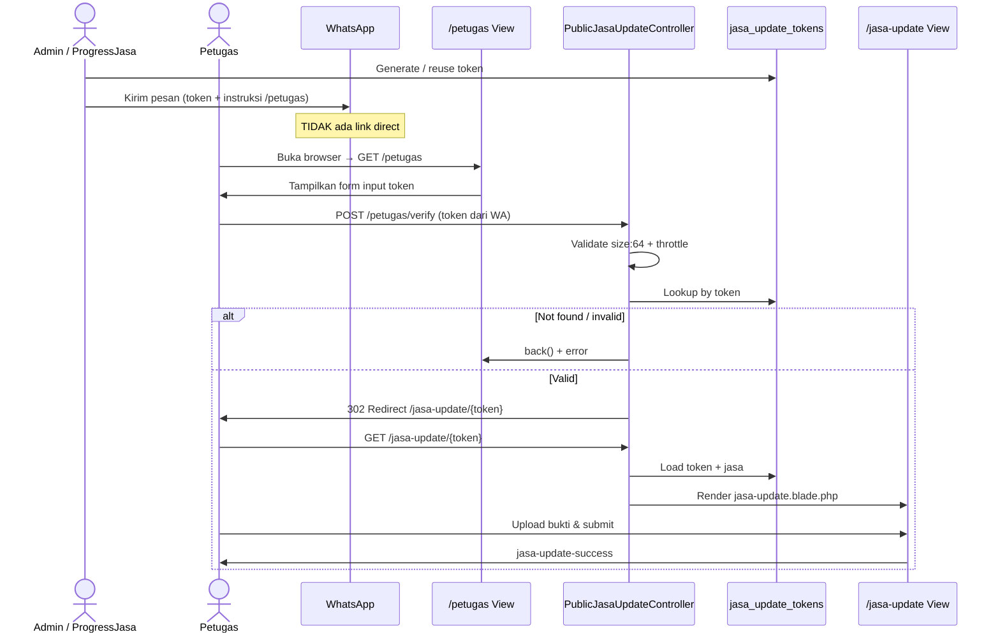

# Plan: Halaman Petugas — Gate Token Jasa Update

> **Dokumen:** Rencana implementasi halaman entry `/petugas` sebelum `jasa-update.blade.php`  
> **Tanggal:** 7 Juli 2026 (revisi 2)  
> **Status:** Draft — siap untuk implementasi

---

## 1. Ringkasan Eksekutif

Saat ini petugas lapangan menerima **link langsung** `/jasa-update/{token}` via WhatsApp dan langsung masuk ke form update.

**Perubahan kebijakan:**
- WhatsApp **tidak lagi mengirim link direct** ke form update
- WhatsApp **hanya mengirim kode token** (`jasa_update_tokens.token`)
- Petugas wajib membuka browser → `https://domain/petugas` → memasukkan kode token → jika valid, redirect ke `https://domain/jasa-update/{token}`

**Tujuan:** Halaman `/petugas` berfungsi seperti form login sederhana — satu-satunya pintu masuk resmi bagi petugas sebelum mengakses form update yang sudah ada (`jasa-update.blade.php`).

**Prinsip desain:**
- URL gate terpisah: `/petugas` (bukan `/jasa-update`)
- WA hanya berisi kode token + instruksi buka `/petugas`
- Halaman update existing (`/jasa-update/{token}`) tetap dipakai **setelah verifikasi** — tidak diubah
- Reuse validasi yang sudah ada di `PublicJasaUpdateController`
- UI konsisten dengan layout public yang sudah dipakai

---

## 2. Kondisi Saat Ini (As-Is)

### 2.1 Alur User



### 2.2 Komponen Terkait

| Komponen | Lokasi | Peran |
|----------|--------|-------|
| Route | `routes/web.php` | `GET/POST jasa-update/{token}` |
| Controller | `app/Http/Controllers/PublicJasaUpdateController.php` | Validasi & render form |
| Model | `app/Models/JasaUpdateToken.php` | Relasi ke Jasa, `isValid()`, `isExpired()` |
| Model | `app/Models/Jasa.php` | `generateUpdateToken()` |
| View form | `resources/views/public/jasa-update.blade.php` | Form upload bukti & update status |
| View sukses | `resources/views/public/jasa-update-success.blade.php` | Konfirmasi selesai |
| View error | `resources/views/errors/access-denied.blade.php` | Token invalid / expired / used |
| Admin trigger | `app/Filament/Pages/ProgressJasa.php` | `buildWaMeLinks()` — **saat ini kirim link direct** |
| Layout | `resources/views/layouts/public.blade.php` | CSS Filament-style, variabel `--aj-*` |

### 2.3 Skema Tabel `jasa_update_tokens`

| Kolom | Tipe | Keterangan |
|-------|------|------------|
| `id` | bigint PK | ID internal — **tidak dikirim ke petugas** |
| `jasa_id` | bigint FK | Relasi ke `jasas.id` |
| `token` | string(64) unique | SHA-256 hash — **kode yang dikirim via WA & diinput petugas** |
| `target_status` | string | Default: `selesai dikerjakan` |
| `is_used` | boolean | `true` setelah form disubmit |
| `used_at` | timestamp nullable | Waktu pemakaian |
| `used_by_ip` | string nullable | Audit trail |
| `used_by_device` | string nullable | User agent |
| `expires_at` | datetime | Default +7 hari dari pembuatan |
| `created_at`, `updated_at` | timestamps | — |

### 2.4 Aturan Validasi Token (Existing)

Token dianggap **valid untuk akses form** jika semua kondisi terpenuhi:

1. Record ditemukan di database (lookup by `token`)
2. `is_used = false`
3. `expires_at > now()` (belum expired, batas 7 hari)
4. `jasa.status = 'terjadwal'`

Jika gagal → tampilkan pesan error di halaman `/petugas` (gate), bukan halaman access-denied.

---

## 3. Kondisi Target (To-Be)

### 3.1 Alur User Baru



### 3.2 Satu Cara Masuk Resmi

| Langkah | URL / Aksi | Keterangan |
|---------|------------|------------|
| 1 | Petugas terima WA | Berisi **kode token** + petunjuk buka `/petugas` |
| 2 | `GET /petugas` | Halaman gate — form input kode token |
| 3 | `POST /petugas/verify` | Validasi token |
| 4 | Redirect | `GET /jasa-update/{token}` — form update existing |

> **Tidak ada lagi link direct** `/jasa-update/{token}` di pesan WhatsApp.

### 3.3 URL Publik

| Halaman | URL | Akses |
|---------|-----|-------|
| Gate petugas | `https://domain/petugas` | Publik, tanpa auth |
| Form update | `https://domain/jasa-update/{token}` | Hanya setelah verifikasi gate (redirect internal) |

---

## 4. Spesifikasi Fungsional

### 4.1 Halaman Petugas (Gate)

**URL:** `GET /petugas`  
**Nama route:** `petugas.gate`  
**View:** `resources/views/public/petugas.blade.php`

#### Elemen UI

| Elemen | Deskripsi |
|--------|-----------|
| Header | Judul: **Portal Petugas** — Subtitle: masukkan kode token dari WhatsApp |
| Input field | Satu field: **Kode Token** |
| Tombol submit | **Lanjutkan** (primary, hijau `--aj-primary`) |
| Pesan error | Inline di form (validation error / token tidak valid) |
| Info box | Petunjuk: buka halaman ini setiap kali update jasa, kode sekali pakai, expired 7 hari |
| Branding | Extend `layouts.public`, centered card max-width ~480px |

#### Perilaku Form

- Method: `POST`
- Action: `route('petugas.verify')`
- CSRF: `@csrf`
- Field name: `token`
- Placeholder: `Tempel kode token dari WhatsApp`
- Autofocus pada input
- Enter key submit form
- Input type: `text` — petugas **copy-paste** token 64 karakter dari pesan WA

### 4.2 Endpoint Verifikasi

**URL:** `POST /petugas/verify`  
**Nama route:** `petugas.verify`  
**Controller method:** `PublicJasaUpdateController@verifyPetugas` (method baru)

#### Input Validation

```php
$request->validate([
    'token' => ['required', 'string', 'size:64'],
], [
    'token.required' => 'Kode token wajib diisi.',
    'token.size'     => 'Kode token tidak valid.',
]);
```

> Token SHA-256 selalu 64 karakter. Validasi `size:64` mencegah input ID numerik atau kode pendek.

#### Logic Lookup

```
INPUT: token (trim whitespace)

1. Cari JasaUpdateToken::where('token', $input)->with(['jasa'])->first()

2. Jika tidak ditemukan:
   → back() + error: "Kode token tidak ditemukan."

3. Jika ditemukan, validasi bisnis:
   - is_used       → "Kode token sudah pernah digunakan."
   - isExpired()   → "Kode token sudah kedaluwarsa (maks. 7 hari)."
   - jasa.status !== 'terjadwal'
                   → "Jasa tidak dapat diupdate. Status saat ini: {status}."

4. Jika semua valid:
   → redirect()->route('jasa.public.update', ['token' => $updateToken->token])
```

### 4.3 Halaman Update (Existing — Tidak Diubah)

`jasa-update.blade.php` dan `PublicJasaUpdateController::show()` **tetap seperti sekarang**. URL `/jasa-update/{token}` hanya diakses via redirect setelah verifikasi gate.

**Opsional (fase 2):** Tambah link "Kembali ke portal petugas" di header → `/petugas`.

### 4.4 Perubahan Pesan WhatsApp (Wajib)

File: `app/Filament/Pages/ProgressJasa.php` — method `buildWaMeLinks()`

**Sebelum (dihapus):**
```
Silakan lakukan update status setelah pekerjaan selesai melalui tautan berikut:

{updateLink}   ← LINK DIRECT, TIDAK LAGI DIKIRIM

Catatan:
• Link hanya dapat digunakan satu kali.
• Link akan kedaluwarsa dalam 7 hari.
```

**Sesudah:**
```
Silakan lakukan update status setelah pekerjaan selesai.

━━━━━━━━━━━━━━━━━━━━
No. Referensi : {no_ref}
Customer      : {nama}
Alamat        : {alamat}
Jadwal        : {jadwal}
━━━━━━━━━━━━━━━━━━━━

Kode Token:
{token}

Langkah:
1. Buka browser dan kunjungi:
   {petugasUrl}
2. Masukkan kode token di atas
3. Ikuti petunjuk update pengerjaan

Catatan:
• Kode token hanya dapat digunakan satu kali.
• Kode token berlaku 7 hari sejak dikirim.
• Mohon tidak membagikan kode token kepada pihak lain.

Terima kasih.
Tim Operasional
```

Variabel baru di controller:
```php
$petugasUrl = route('petugas.gate'); // https://domain/petugas
// Hapus variabel $updateLink dari pesan WA
// Simpan $existingToken->token atau $token untuk ditampilkan di pesan
```

---

## 5. Spesifikasi Routing

### 5.1 Route Baru (Terpisah dari jasa-update)

Route `/petugas` **tidak** digabung dengan prefix `jasa-update` — keduanya independen.

```php
// routes/web.php

// Portal petugas — gate token (BARU)
Route::prefix('petugas')->name('petugas.')->group(function () {
    Route::get('/', [PublicJasaUpdateController::class, 'petugasGate'])
        ->name('gate');
    Route::post('/verify', [PublicJasaUpdateController::class, 'verifyPetugas'])
        ->name('verify')
        ->middleware('throttle:10,1'); // 10 percobaan per menit
});

// Public jasa update routes — EXISTING (hanya diakses setelah redirect gate)
Route::prefix('jasa-update')->name('jasa.public.')->group(function () {
    Route::get('/{token}', [PublicJasaUpdateController::class, 'show'])
        ->name('update');
    Route::post('/{token}', [PublicJasaUpdateController::class, 'update'])
        ->name('update.submit');
});
```

### 5.2 Daftar Route Lengkap

| Method | URI | Name | Controller@Method | Keterangan |
|--------|-----|------|-------------------|------------|
| GET | `/petugas` | `petugas.gate` | `petugasGate` | Form input token — **entry point petugas** |
| POST | `/petugas/verify` | `petugas.verify` | `verifyPetugas` | Validasi token → redirect |
| GET | `/jasa-update/{token}` | `jasa.public.update` | `show` | Form update (setelah redirect) |
| POST | `/jasa-update/{token}` | `jasa.public.update.submit` | `update` | Submit update |

---

## 6. Perubahan Controller

### 6.1 File: `PublicJasaUpdateController.php`

#### Method Baru: `petugasGate()`

```php
public function petugasGate()
{
    return view('public.petugas');
}
```

#### Method Baru: `verifyPetugas(Request $request)`

- Validasi input `token` (required, size 64)
- Lookup `JasaUpdateToken::where('token', ...)`
- Validasi bisnis (used, expired, status jasa)
- Redirect ke `jasa.public.update` atau back dengan error

#### Refactor: Extract `validateUpdateTokenAccess(JasaUpdateToken $updateToken): ?string`

Return `null` jika valid, atau string pesan error. Dipakai oleh `verifyPetugas()` dan bisa dipakai ulang di `show()` (fase 2).

### 6.2 Pseudocode Lengkap `verifyPetugas()`

```php
public function verifyPetugas(Request $request)
{
    $request->validate([
        'token' => ['required', 'string', 'size:64'],
    ], [
        'token.required' => 'Kode token wajib diisi.',
        'token.size'     => 'Kode token tidak valid.',
    ]);

    $token = trim($request->token);

    $updateToken = JasaUpdateToken::where('token', $token)
        ->with(['jasa'])
        ->first();

    if (!$updateToken) {
        return back()
            ->withInput()
            ->withErrors(['token' => 'Kode token tidak ditemukan.']);
    }

    $errorMessage = $this->validateUpdateTokenAccess($updateToken);
    if ($errorMessage) {
        return back()
            ->withInput()
            ->withErrors(['token' => $errorMessage]);
    }

    return redirect()->route('jasa.public.update', [
        'token' => $updateToken->token,
    ]);
}
```

### 6.3 Helper: `validateUpdateTokenAccess()`

```php
private function validateUpdateTokenAccess(JasaUpdateToken $updateToken): ?string
{
    if ($updateToken->is_used) {
        return 'Kode token sudah pernah digunakan.';
    }

    if ($updateToken->isExpired()) {
        return 'Kode token sudah kedaluwarsa (maks. 7 hari).';
    }

    if ($updateToken->jasa->status !== 'terjadwal') {
        return 'Jasa tidak dapat diupdate. Status saat ini: '
            . ucwords($updateToken->jasa->status) . '.';
    }

    return null;
}
```

---

## 7. Desain UI — Halaman `/petugas`

### 7.1 Wireframe (Desktop)

```
┌─────────────────────────────────────────────────────────┐
│  page-header (layouts.public)                           │
│  ┌───────────────────────────────────────────────────┐  │
│  │  Portal Petugas                                   │  │
│  │  Masukkan kode token yang diterima via WhatsApp   │  │
│  └───────────────────────────────────────────────────┘  │
│                                                         │
│  container (max-width 480px, centered)                  │
│  ┌───────────────────────────────────────────────────┐  │
│  │  fi-section                                       │  │
│  │  ┌─────────────────────────────────────────────┐  │  │
│  │  │  🔑  Verifikasi Kode Token                  │  │  │
│  │  │  Salin kode token dari pesan WhatsApp       │  │  │
│  │  ├─────────────────────────────────────────────┤  │  │
│  │  │                                             │  │  │
│  │  │  Kode Token *                               │  │  │
│  │  │  ┌─────────────────────────────────────┐    │  │  │
│  │  │  │  [ input text — paste token WA   ]  │    │  │  │
│  │  │  └─────────────────────────────────────┘    │  │  │
│  │  │  ⚠ Error message (if any)                   │  │  │
│  │  │                                             │  │  │
│  │  │  ┌─────────────────────────────────────┐    │  │  │
│  │  │  │         [ Lanjutkan → ]             │    │  │  │
│  │  │  └─────────────────────────────────────┘    │  │  │
│  │  │                                             │  │  │
│  │  │  ┌─ catatan-box ─────────────────────────┐  │  │  │
│  │  │  │ ℹ Buka halaman ini: domain/petugas    │  │  │  │
│  │  │  │ ℹ Kode token berlaku 7 hari           │  │  │  │
│  │  │  │ ℹ Satu kode = satu kali update        │  │  │  │
│  │  │  │ ℹ Hubungi admin jika kode bermasalah  │  │  │  │
│  │  │  └───────────────────────────────────────┘  │  │  │
│  │  └─────────────────────────────────────────────┘  │  │
│  └───────────────────────────────────────────────────┘  │
└─────────────────────────────────────────────────────────┘
```

### 7.2 Style Guidelines

Reuse class dari `layouts/public.blade.php`:

- `.fi-section`, `.fi-section-header`, `.fi-section-content`
- `.fi-action-btn-primary` untuk tombol submit
- `.fi-error-message` untuk error validation
- `.catatan-box` untuk info petunjuk
- Class lokal:
  - `.petugas-container` — `max-width: 480px; margin: 0 auto;`
  - `.petugas-input` — full width, `font-family: monospace`, `font-size: 13px` (mudah baca token panjang)

### 7.3 Responsive

- Mobile: padding container 20px 16px
- Input font-size min 16px di mobile (cegah zoom iOS) — gunakan monospace hanya di desktop
- Tombol full-width di `< 640px`
- Token 64 char: input bisa `word-break: break-all` agar tidak overflow

---

## 8. Keamanan

### 8.1 Rate Limiting

| Endpoint | Limit | Alasan |
|----------|-------|--------|
| `POST /petugas/verify` | 10 req/menit/IP | Cegah brute-force token |
| `GET /jasa-update/{token}` | (existing) | Token 64-char — akses hanya setelah gate |

### 8.2 Pesan Error

- **Gate form (`/petugas`):** Pesan spesifik (expired, used, status invalid) — petugas internal perlu feedback jelas
- **Lookup tidak ditemukan:** *"Kode token tidak ditemukan."* — generik

### 8.3 Logging

```php
\Log::warning('Petugas gate verify failed', [
    'ip'     => $request->ip(),
    'reason' => 'not_found' | 'used' | 'expired' | 'invalid_status',
]);
```

Jangan log full token di production.

### 8.4 CSRF

Form `/petugas` wajib `@csrf`.

### 8.5 Akses Direct ke `/jasa-update/{token}`

URL `/jasa-update/{token}` **technically masih bisa diakses** jika seseorang mengetahui token (misal dari history browser setelah redirect). Ini **bukan celah baru** — token 64-char sudah cukup aman.

Tidak perlu block direct access untuk MVP. Jika di masa depan ingin **wajib lewat gate**, bisa tambah session flag setelah verify — out of scope revisi ini.

---

## 9. Integrasi Admin / WhatsApp

### 9.1 Perubahan Wajib di `ProgressJasa::buildWaMeLinks()`

| Aspek | Sebelum | Sesudah |
|-------|---------|---------|
| Isi pesan WA | Link direct `/jasa-update/{token}` | Kode token saja |
| Instruksi | Klik link | Buka `/petugas`, paste token |
| Variabel `$updateLink` | Dipakai di pesan | **Dihapus dari pesan** (route tetap ada untuk redirect internal) |
| Variabel baru | — | `$petugasUrl = route('petugas.gate')` |
| Token di pesan | Embedded di URL | Ditampilkan plain text agar bisa di-copy |

### 9.2 Contoh Pesan WA Final

```
Halo,

Terdapat pekerjaan jasa yang memerlukan pembaruan status.

━━━━━━━━━━━━━━━━━━━━
No. Referensi : JSA-2026-001
Customer      : Budi Santoso
Alamat        : Jl. Merdeka No. 10
Jadwal        : 08/07/2026
━━━━━━━━━━━━━━━━━━━━

Kode Token:
a3f8c2e1b9d4... (64 karakter)

Langkah:
1. Buka browser dan kunjungi:
   https://domain/petugas
2. Masukkan kode token di atas
3. Ikuti petunjuk update pengerjaan

Catatan:
• Kode token hanya dapat digunakan satu kali.
• Kode token berlaku 7 hari sejak dikirim.
• Mohon tidak membagikan kode token kepada pihak lain.

Terima kasih.
Tim Operasional
```

### 9.3 Filament Admin

Tidak perlu UI admin baru. Opsional fase 2: tampilkan kode token & URL `/petugas` di panel ProgressJasa untuk admin copy manual.

---

## 10. Daftar File — Checklist Implementasi

### 10.1 File Baru

| File | Deskripsi |
|------|-----------|
| `resources/views/public/petugas.blade.php` | Halaman gate `/petugas` |
| `jasa-update.md` | Dokumen plan ini |

### 10.2 File Dimodifikasi

| File | Perubahan |
|------|-----------|
| `routes/web.php` | Tambah route group `/petugas` |
| `app/Http/Controllers/PublicJasaUpdateController.php` | Method `petugasGate()`, `verifyPetugas()`, helper `validateUpdateTokenAccess()` |
| `app/Filament/Pages/ProgressJasa.php` | **Wajib:** Hapus link direct dari pesan WA, kirim token + URL `/petugas` |

### 10.3 File Tidak Diubah

| File | Alasan |
|------|--------|
| `resources/views/public/jasa-update.blade.php` | Form update tetap sama |
| `resources/views/public/jasa-update-success.blade.php` | Flow sukses unchanged |
| `app/Models/JasaUpdateToken.php` | Logic model sudah cukup |
| `database/migrations/*` | Skema sudah mendukung |

---

## 11. Rencana Testing

### 11.1 Test Manual — Halaman Petugas

| # | Skenario | Input | Expected |
|---|----------|-------|----------|
| 1 | Token valid & aktif | token 64-char valid | Redirect ke `/jasa-update/{token}` |
| 2 | Token tidak ada | string random 64 char | Error: tidak ditemukan |
| 3 | Token terlalu pendek | `abc123` | Validation error size |
| 4 | Token sudah used | token used | Error: sudah pernah digunakan |
| 5 | Token expired | token expired | Error: kedaluwarsa |
| 6 | Jasa status bukan terjadwal | valid token, status lain | Error: status tidak valid |
| 7 | Field kosong | empty | Validation error required |
| 8 | Rate limit | 11+ POST cepat | HTTP 429 |
| 9 | CSRF invalid | tanpa token | 419 Page Expired |
| 10 | Copy-paste token dari WA | token dengan whitespace | Trim → valid |

### 11.2 Test Manual — Flow Lengkap

| # | Skenario | Expected |
|---|----------|----------|
| 11 | Buka `/petugas` → input valid → submit | Form update jasa tampil |
| 12 | Submit form update setelah gate | Sukses → jasa-update-success |
| 13 | Pesan WA dari ProgressJasa | **Tidak ada link direct**, ada kode token + URL `/petugas` |
| 14 | Token di WA sama dengan yang diinput | Verifikasi sukses |

### 11.3 Test Feature (PHPUnit — Opsional Fase 2)

```php
// tests/Feature/PetugasGateTest.php

public function test_petugas_page_renders()
public function test_verify_with_valid_token_redirects_to_update_form()
public function test_verify_with_invalid_token_returns_error()
public function test_verify_with_used_token_returns_error()
public function test_wa_message_does_not_contain_direct_link()
```

---

## 12. Fase Implementasi

### Fase 1 — MVP (Prioritas Tinggi)

1. Tambah route group `/petugas` di `web.php`
2. Implement `petugasGate()` & `verifyPetugas()` + helper di controller
3. Buat view `petugas.blade.php`
4. **Update `ProgressJasa::buildWaMeLinks()`** — hapus link direct, kirim token + `/petugas`
5. Manual testing skenario 1–14
6. Deploy

**Estimasi:** ~3–4 jam development + testing

### Fase 2 — Enhancement (Opsional)

1. Refactor `show()` pakai `validateUpdateTokenAccess()` shared helper
2. Link "Kembali ke portal petugas" di header `jasa-update.blade.php`
3. Tampilkan kode token di panel admin ProgressJasa
4. Feature tests PHPUnit
5. Session gate flag (wajib lewat `/petugas` sebelum akses form) — jika diperlukan

### Fase 3 — Nice to Have

1. Short code token (6–8 char) untuk memudahkan input manual — butuh migration kolom `short_code`
2. QR code di admin berisi URL `/petugas` (bukan link direct update)

---

## 13. Edge Cases & Keputusan

| Kasus | Keputusan |
|-------|-----------|
| Petugas paste token dengan spasi/newline | `trim()` sebelum lookup |
| Token valid tapi jasa dihapus (cascade) | Token ikut terhapus → not found |
| Multiple valid tokens untuk satu jasa | WA reuse token terbaru (existing behavior ProgressJasa) |
| Petugas bookmark `/jasa-update/{token}` setelah redirect | Masih bisa akses — acceptable untuk MVP |
| Petugas ketik token manual (64 char) | Sulit — disarankan copy-paste dari WA; catatan di UI |
| Token di WA terpotong (copy tidak lengkap) | Validation `size:64` gagal → pesan "Kode token tidak valid" |
| Domain production vs staging | `route('petugas.gate')` otomatis pakai `APP_URL` |

---

## 14. Contoh Kode View Petugas (Draft)

```blade
{{-- resources/views/public/petugas.blade.php --}}
@extends('layouts.public')

@section('title', 'Portal Petugas - Artha Jaya')

@section('header')
    <div class="fi-header">
        <h1 class="fi-header-title">Portal Petugas</h1>
        <p class="fi-header-subtitle">Masukkan kode token yang diterima via WhatsApp</p>
    </div>
@endsection

@section('content')
    <div class="petugas-container">
        <div class="fi-section">
            <div class="fi-section-header">
                <h3 class="fi-section-header-heading">Verifikasi Kode Token</h3>
                <p class="fi-section-header-description">Salin kode token dari pesan WhatsApp</p>
            </div>
            <div class="fi-section-content">
                <form action="{{ route('petugas.verify') }}" method="POST">
                    @csrf

                    <div class="form-group">
                        <label class="form-label" for="token">Kode Token</label>
                        <input
                            type="text"
                            id="token"
                            name="token"
                            class="form-textarea petugas-input"
                            style="resize: none; min-height: auto; font-family: monospace;"
                            value="{{ old('token') }}"
                            placeholder="Tempel kode token dari WhatsApp"
                            autocomplete="off"
                            autocapitalize="off"
                            spellcheck="false"
                            autofocus
                            required
                        >
                        @error('token')
                            <p class="fi-error-message">{{ $message }}</p>
                        @enderror
                    </div>

                    <div class="fi-actions" style="margin-top: 20px;">
                        <button type="submit" class="fi-action-btn fi-action-btn-primary">
                            Lanjutkan
                        </button>
                    </div>
                </form>

                <div class="catatan-box" style="margin-top: 24px;">
                    <div class="catatan-content">
                        <div class="catatan-label">Petunjuk</div>
                        <div class="catatan-text">
                            • Buka halaman ini di: <strong>{{ url('/petugas') }}</strong><br>
                            • Salin kode token lengkap dari pesan WhatsApp<br>
                            • Kode token berlaku maksimal 7 hari<br>
                            • Satu kode hanya dapat digunakan sekali<br>
                            • Hubungi administrator jika kode bermasalah
                        </div>
                    </div>
                </div>
            </div>
        </div>
    </div>
@endsection
```

---

## 15. Diagram Sequence — Flow Lengkap



---

## 16. Acceptance Criteria

Implementasi dianggap **selesai** jika:

- [ ] `GET /petugas` menampilkan halaman gate dengan form input kode token
- [ ] `POST /petugas/verify` menerima token valid → redirect ke `/jasa-update/{token}`
- [ ] Input invalid menampilkan pesan error di halaman `/petugas`
- [ ] Pesan WhatsApp **tidak lagi** mengandung link `/jasa-update/{token}`
- [ ] Pesan WhatsApp **mengandung** kode token + URL `/petugas` + instruksi langkah
- [ ] Form update existing (`jasa-update.blade.php`) tidak terpengaruh
- [ ] Submit update setelah gate berhasil seperti biasa
- [ ] Rate limiting aktif pada `POST /petugas/verify`
- [ ] UI konsisten dengan design system public layout
- [ ] Responsive di mobile

---

## 17. Referensi Kode Existing

```php
// Validasi di show() — app/Http/Controllers/PublicJasaUpdateController.php:18-45
$updateToken = JasaUpdateToken::where('token', $token)->with(['jasa.pelanggan'])->first();
// checks: exists, is_used, isExpired(), jasa.status === 'terjadwal'
```

```php
// Pembuatan token — app/Models/Jasa.php:227-257
$token = hash('sha256', $this->id . now()->timestamp . config('app.key'));
JasaUpdateToken::create([..., 'expires_at' => now()->addDays(7)]);
```

```php
// Pesan WA saat ini (AKAN DIUBAH) — app/Filament/Pages/ProgressJasa.php:714-748
$updateLink = route('jasa.public.update', ['token' => $existingToken->token]);
$message .= "{$updateLink}\n\n"; // ← DIHAPUS
```

---

## 18. Changelog Dokumen

| Versi | Tanggal | Perubahan |
|-------|---------|-----------|
| v1 | 7 Jul 2026 | Plan awal — gate di `/jasa-update`, backward compatible direct link |
| v2 | 7 Jul 2026 | Gate pindah ke `/petugas`, WA hanya kirim token (no direct link), lookup hanya by `token` |

---

*Dokumen revisi 2 siap digunakan sebagai acuan implementasi. Setelah disetujui, lanjut ke Fase 1.*
