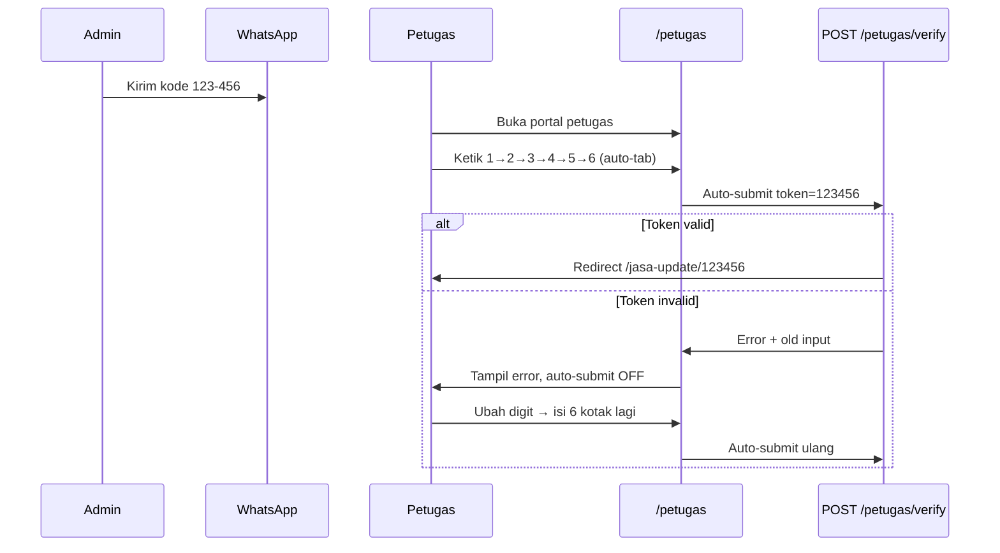

# Rencana: Kode Token Numerik OTP — Portal Petugas

> **Dokumen:** Rencana perubahan kode token dari hash 64 karakter menjadi kode numerik 6 digit dengan input OTP di halaman `/petugas`
> **Tanggal:** 8 Jul 2026

---

## 1. Latar Belakang

Saat ini kode token berupa **SHA-256 hash 64 karakter** yang sulit diketik manual oleh petugas lapangan. Petugas harus copy-paste dari WhatsApp ke satu field teks panjang.

**Tujuan:** Ganti token menjadi **kode numerik 6 digit** dengan format tampilan `123-456`, dan input UI berupa kotak OTP terpisah agar petugas bisa mengetik cepat di HP.

---

## 2. Format Token Baru

| Aspek | Sebelum | Sesudah |
|-------|---------|---------|
| Format | `a3f8b2c1...` (64 hex) | `123456` (6 digit angka) |
| Tampilan WA | Satu baris panjang | `123-456` (3 digit + dash + 3 digit) |
| Penyimpanan DB | `string(64)` | Tetap `string(64)` — cukup simpan `"123456"` |
| Validasi gate | `size:64` | `digits:6` / regex `^\d{6}$` |
| URL update | `/jasa-update/{token}` | `/jasa-update/123456` (lebih pendek) |

**Catatan keamanan:** 1 juta kombinasi + rate limit `10 req/menit/IP` + token sekali pakai + expiry 7 hari — cukup untuk use case internal petugas.

---

## 3. Perubahan Backend

### 3.1 `Jasa::generateUpdateToken()`

- Generate angka acak 6 digit (`000000`–`999999`)
- Loop sampai unik di tabel `jasa_update_tokens`
- Simpan tanpa dash di kolom `token`

### 3.2 `PublicJasaUpdateController::verifyPetugas()`

- Normalisasi input: hapus karakter non-digit (termasuk dash dari paste)
- Validasi: wajib 6 digit angka
- Lookup token tetap `JasaUpdateToken::where('token', $token)`

### 3.3 `ProgressJasa::buildWaMeLinks()`

- Format tampilan token di pesan WA: `XXX-XXX`
  ```php
  $displayToken = substr($updateToken, 0, 3) . '-' . substr($updateToken, 3, 3);
  ```

### 3.4 Token lama (hash 64 karakter)

- Token hash yang sudah terbit **tidak kompatibel** dengan validasi baru
- Tidak perlu migrasi data — admin cukup kirim ulang WA untuk jasa yang masih aktif

---

## 4. Desain UI OTP — `petugas.blade.php`

### 4.1 Layout Input

```
┌─────────────────────────────────────┐
│  [1] [2] [3]  -  [4] [5] [6]        │
└─────────────────────────────────────┘
         ↑ hidden input: token=123456
```

- 6 kotak `<input>` terpisah, masing-masing `maxlength="1"`, `inputmode="numeric"`, `pattern="[0-9]"`
- Separator visual `-` di tengah (bukan input)
- Hidden field `name="token"` berisi gabungan 6 digit untuk form POST

### 4.2 Perilaku Input

| Aksi | Perilaku |
|------|----------|
| Ketik 1 angka | Isi kotak saat ini → fokus otomatis ke kotak berikutnya |
| Backspace di kotak kosong | Fokus ke kotak sebelumnya |
| Paste `123-456` atau `123456` | Distribusi ke semua kotak |
| Arrow keys | Navigasi antar kotak |

### 4.3 Auto-Submit

- Ketika **semua 6 kotak terisi** → form submit otomatis (tanpa klik tombol)
- Tombol "Verifikasi" tetap ada sebagai fallback manual
- Saat submit: disable input + tampilkan state loading

### 4.4 Penanganan Error (Token Salah)

```
Server return error → autoSubmitEnabled = false
User ubah minimal 1 digit → autoSubmitEnabled = true
Semua 6 kotak terisi lagi → auto-submit jalan lagi
```

- Flag JS `autoSubmitEnabled` default `true`
- Jika `$errors->has('token')` → set `false` saat page load
- Track `lastSubmittedToken` agar tidak double-submit token yang sama
- Pre-fill kotak dari `old('token')` jika ada

---

## 5. Alur Lengkap



---

## 6. File yang Diubah

| File | Perubahan |
|------|-----------|
| `token-update.md` | Dokumen rencana ini |
| `app/Models/Jasa.php` | `generateUpdateToken()` → 6 digit numerik |
| `app/Http/Controllers/PublicJasaUpdateController.php` | Validasi 6 digit + normalisasi input |
| `app/Filament/Pages/ProgressJasa.php` | Format token `XXX-XXX` di pesan WA |
| `resources/views/public/petugas.blade.php` | UI OTP + CSS + JavaScript auto-tab/auto-submit |

**Tidak diubah:** migration DB, route, model `JasaUpdateToken`, halaman `jasa-update` (token di URL otomatis lebih pendek).

---

## 7. CSS OTP (Ringkas)

```css
.otp-group       → flex, center, gap
.otp-digit       → 48×56px, border, radius, font-size 24px, text-align center
.otp-separator   → font-size 24px, color muted, user-select none
.otp-digit:focus → border-color primary
.otp-digit.error → border-color error (saat validation fail)
.otp-loading     → opacity + pointer-events none saat submitting
```

Mobile: kotak sedikit lebih besar (`52×60px`), font `28px` agar mudah disentuh.

---

## 8. Checklist Testing

- [ ] Token baru yang digenerate admin berupa 6 digit angka
- [ ] Pesan WA menampilkan format `123-456`
- [ ] Input 1 digit → auto pindah ke kotak berikutnya
- [ ] Backspace → kembali ke kotak sebelumnya
- [ ] Paste `123-456` → semua kotak terisi
- [ ] 6 kotak terisi → form submit otomatis
- [ ] Token salah → error tampil, tidak auto-submit lagi
- [ ] Ubah 1 digit setelah error → isi 6 kotak → auto-submit aktif lagi
- [ ] Token valid → redirect ke form update jasa
- [ ] Tombol manual masih berfungsi sebagai fallback

---

## 9. Urutan Implementasi

1. ✅ Buat `token-update.md` (dokumen ini)
2. ✅ Update `generateUpdateToken()` — backend token numerik
3. ✅ Update `verifyPetugas()` — validasi 6 digit
4. ✅ Update pesan WA di `ProgressJasa`
5. ✅ Rebuild `petugas.blade.php` — UI OTP + JavaScript
